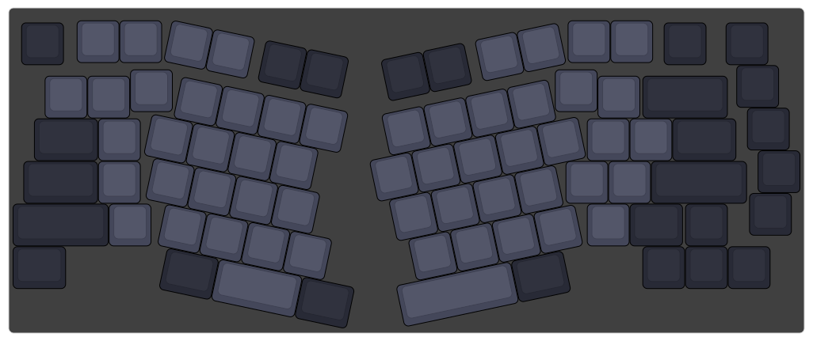
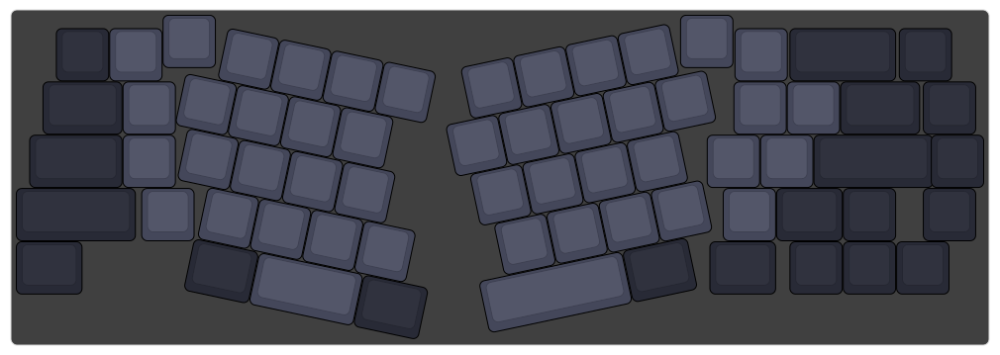

# ErgoCheap (Handwired, Acrylic Case)

>Ergonomic Keyboard inspired from Arisu keyboard [Maker Github](https://github.com/FateNozomi) *with keycaps size adjustment*
>Keyboard Ergo terinspirasi dari Arisu Keyboard dengan keycap ukuran standar dan MX style switch. 
---
# Content:

1. <a name="Layout">Layout</a>
2. <a name="Things">Things you need</a> 
3. <a name="Case">Case</a>
4. <a name="Ref">Reference & App used</a>

--------------------------------------------------

## [Layout] (#Layout)

>
>

## 	[Things you need] (#Things)

Material 						| Quantity							| Detail
------------ 					| -------------						| -------
68 MX Switch (65%) / 82 ((75%) 	| 68pcs / 82pcs						| JANGAN BELI PAS-PASAN, MENGHINDARI SWITCH RUSAK.
1N418 Diode						| 68 / 82 pcs 						| BELI SPARE 10 kalo gagal pasang.
Keycaps							| 1 Set (104keys)					| Keycaps ukuran standar ANSI.
STM32F103C8T6 ARM STM32			| 1pcs								| bisa pake alternatif lain. minimal ada 30 pinout (tidak bisa pake pro micro!!)
PIN HEADER STRIP MALE L SHAPE	| 1pcs								| Memudahkan wiring ke module.
Kabel jumper female 20cm		| 40pcs								| Wiring col & row.
Kabel micro usb					| 1pcs								| Skip kalau sudah ada.

## [Acrylic Case] (#Case)

>*(will be updated soon!)*

-------------------------------

## [Reference & App used] (#ref)

>*(will be updated soon!)*
